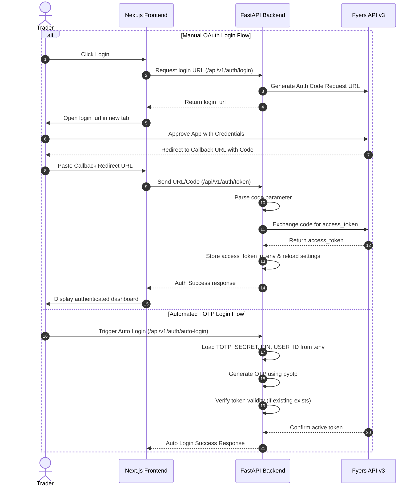
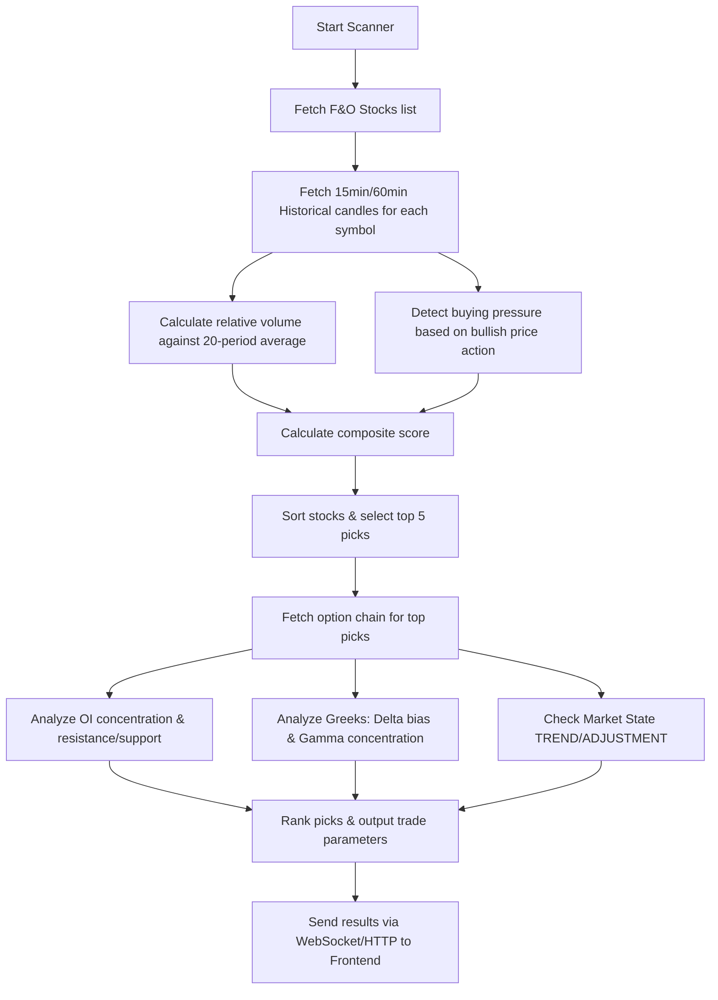
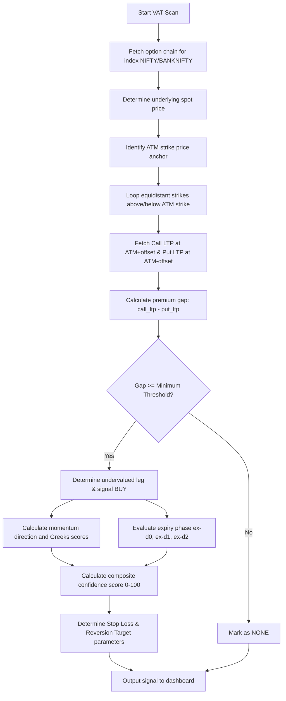
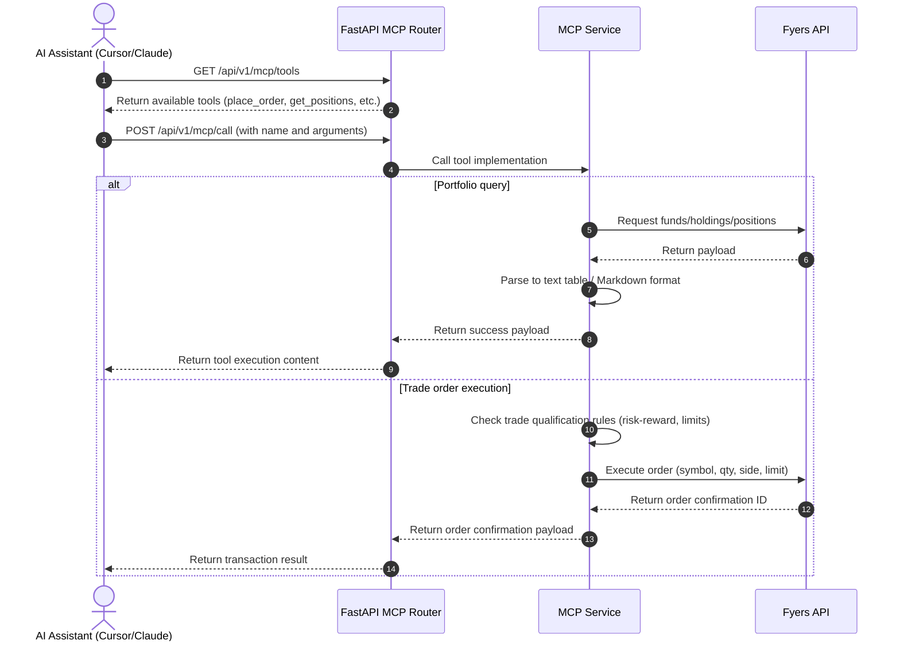

# PROJECT_STRUCTURE.md - OptionGreek System Architecture & Codebase Guide

OptionGreek is a real-time option intelligence and market structure engine designed to analyze option price behavior, market structure, and institutional activity. It detects premium distortions, identifies adjustment trades, and generates high-probability scalp/arbitrage signals based on institutional order flows rather than traditional technical indicators.

---

## Table of Contents
1. [Phase 1: Repository Overview](#phase-1-repository-overview)
2. [Phase 2: Directory Tree](#phase-2-directory-tree)
3. [Phase 3: File Analysis](#phase-3-file-analysis)
4. [Phase 4: Flow Analysis](#phase-4-flow-analysis)
5. [Phase 5: Database Analysis (Data Flow)](#phase-5-database-analysis)
6. [Phase 6: Environment Variables](#phase-6-environment-variables)
7. [Phase 7: API Analysis](#phase-7-api-analysis)
8. [Phase 8: Dependency Analysis](#phase-8-dependency-analysis)
9. [Phase 9: Deployment Analysis](#phase-9-deployment-analysis)
10. [Phase 10: Custom Notes & Technical Debt](#phase-10-custom-notes)

---

## Phase 1: Repository Overview

| Property | Details |
| :--- | :--- |
| **Project Name** | OptionGreek |
| **Purpose** | Real-time option premium intelligence, market structure analysis, and institutional flow tracking. |
| **Main Functionality** | Option chain analytics, Black-Scholes Greeks calculation, Value Adjustment Theory (VAT) scanning, Nifty market sentiment tracking, multi-threaded high-volume F&O stock scanning, Model Context Protocol (MCP) server for AI agent integration, and manual/automated trading order placement. |
| **Frontend Tech Stack** | Next.js (React 19, TypeScript, TanStack React Query v5) |
| **Backend Tech Stack** | FastAPI (Python 3.13, Uvicorn, WebSockets, Pandas, SciPy, Pydantic v2) |
| **Database** | None (Stateless system using Fyers broker API as the source of truth, persisting authentication state locally in `.env`) |
| **External APIs** | **Fyers API v3** (Brokerage and Live Market Data feeds), **Grok API** (Future support for news contextual intelligence) |
| **Package Managers** | `pip` (Python/Backend), `npm` (Node.js/Frontend) |
| **Runtime Requirements** | Python 3.10+ (Python 3.13 recommended), Node.js 18+ (Node.js 20+ recommended) |
| **Build System** | Standard Docker image builders, Next.js build systems |
| **Hosting Recommendations** | **Backend**: AWS ECS / Vercel / Render / Docker Container Service. **Frontend**: Vercel / Netlify. |

---

## Phase 2: Directory Tree

The repository is structured as a monorepo containing a Python FastAPI backend and a Next.js frontend, along with playbook documents and utility scripts at the root level.

```
/ (root)
├── backend/
│   ├── app/
│   │   ├── core/
│   │   ├── models/
│   │   ├── routes/
│   │   └── services/
│   │       └── strategies/
│   │   ├── __init__.py
│   │   └── main.py
│   ├── .dockerignore
│   ├── .env
│   ├── .env.example
│   ├── .gitignore
│   ├── Dockerfile
│   ├── README.md
│   ├── diagnose_fyers.py
│   ├── requirements.txt
│   ├── test_fyers_apis.py
│   └── update_fyers_token.py
├── frontend/
│   ├── app/
│   ├── components/
│   ├── lib/
│   │   └── hooks/
│   ├── .gitignore
│   ├── README.md
│   ├── eslint.config.mjs
│   ├── next-env.d.ts
│   ├── next.config.ts
│   ├── package-lock.json
│   ├── package.json
│   ├── postcss.config.mjs
│   ├── public/
│   └── tsconfig.json
├── AGENT_INTEGRATION.md
├── Intraday_Gamma_Repricing_Scalp_Playbook.pdf
├── TLB FINAL MANUSCRIPT.pdf
├── claude_desktop_config.json
├── dev.bat
├── dev.ps1
├── fnoanalysis.md
├── fyersApi.log
├── fyersRequests.log
├── manuscript_text.txt
├── optionsnapback.txt
├── readme.md
└── test_quant_flow.py
```

### Directory Roles & Responsibilities

| Directory Path | Purpose & Responsibilities | Key Dependencies | Used By |
| :--- | :--- | :--- | :--- |
| [/](file:///d:/quant_trade-analysis/) | Workspace root containing project documentation, integration guides, manuscripts, and startup scripts. | Batch, PowerShell | Developer workflow |
| [backend/](file:///d:/quant_trade-analysis/backend) | Python FastAPI application containing backend logic, services, routing, and connection diagnostic scripts. | Python 3, `pip` packages | Deployment / Frontend |
| [backend/app/](file:///d:/quant_trade-analysis/backend/app) | Core source folder for the FastAPI application. | FastAPI | `app/main.py` |
| [backend/app/core/](file:///d:/quant_trade-analysis/backend/app/core) | Configuration settings loader utilizing `pydantic-settings`. | `pydantic-settings` | All backend modules |
| [backend/app/models/](file:///d:/quant_trade-analysis/backend/app/models) | Pydantic data schemas normalizing Fyers API data structures. | `pydantic` | Backend routes & services |
| [backend/app/routes/](file:///d:/quant_trade-analysis/backend/app/routes) | FastAPI HTTP endpoints and WebSocket routing implementations. | FastAPI, WebSockets | Next.js Frontend |
| [backend/app/services/](file:///d:/quant_trade-analysis/backend/app/services) | Business logic layer executing market scans, auth, sentiment calculations, and MCP tools. | `fyers-apiv3`, `scipy` | Backend routes |
| [backend/app/services/strategies/](file:///d:/quant_trade-analysis/backend/app/services/strategies) | Option trading strategy engines (Value Adjustment Theory scan logic). | `fyers_market` service | `app/routes/strategies.py` |
| [frontend/](file:///d:/quant_trade-analysis/frontend) | React/TypeScript Next.js client application. | Node.js, `npm` packages | End-user browser |
| [frontend/app/](file:///d:/quant_trade-analysis/frontend/app) | Next.js App Router root layout and landing page. | React, Tailwind | Next.js Engine |
| [frontend/components/](file:///d:/quant_trade-analysis/frontend/components) | UI components (Option chain, Sentiment cards, Greeks heatmap, Scanner view). | React, Tailwind CSS | Next.js pages |
| [frontend/lib/](file:///d:/quant_trade-analysis/frontend/lib) | Frontend utilities including API clients, Query Client providers, and custom hooks. | TanStack Query | Frontend components |

---

## Phase 3: File Analysis

### 1. Root-Level Files

#### File: [AGENT_INTEGRATION.md](file:///d:/quant_trade-analysis/AGENT_INTEGRATION.md)
* **Purpose**: Explains how to integrate AI coding assistants (Cursor, Claude Desktop) with OptionGreek via the Model Context Protocol (MCP) server.
* **Exports**: None.
* **Imports**: None.
* **Used By**: Developers setting up local AI agents.

#### File: [claude_desktop_config.json](file:///d:/quant_trade-analysis/claude_desktop_config.json)
* **Purpose**: Sample MCP server configuration file for Claude Desktop using HTTP transport layer pointing to `http://localhost:8000/api/v1/mcp`.
* **Used By**: Claude Desktop application.

#### File: [dev.bat](file:///d:/quant_trade-analysis/dev.bat) & [dev.ps1](file:///d:/quant_trade-analysis/dev.ps1)
* **Purpose**: Startup script to launch the FastAPI backend (`uvicorn app.main:app`) and the Next.js frontend (`npm run dev`) simultaneously on Windows.
* **Used By**: Developers in local environment.

#### File: [fnoanalysis.md](file:///d:/quant_trade-analysis/fnoanalysis.md)
* **Purpose**: Analytical playbook detailing F&O intelligence, highlighting the concept that options reveal true institutional positioning while underlying spot prices can contain false breakouts.
* **Used By**: Documentation/onboarding.

#### File: [manuscript_text.txt](file:///d:/quant_trade-analysis/manuscript_text.txt) & [TLB FINAL MANUSCRIPT.pdf](file:///d:/quant_trade-analysis/TLB FINAL MANUSCRIPT.pdf)
* **Purpose**: The "Trade Like Berlin" manuscript detailing Value Adjustment Theory, Numerical Theory, Adjustment Theory, and Big Money Theory for option trading.
* **Used By**: Strategy implementation reference.

#### File: [optionsnapback.txt](file:///d:/quant_trade-analysis/optionsnapback.txt) & [Intraday_Gamma_Repricing_Scalp_Playbook.pdf](file:///d:/quant_trade-analysis/Intraday_Gamma_Repricing_Scalp_Playbook.pdf)
* **Purpose**: Playbook for Nifty Weekly Index Options scalping. Details how panic-induced premium collapses (55-70% drop) reprice rapidly when dealer gamma rebalancing forces buying/selling during index stalls.
* **Used By**: Strategy reference.

#### File: [readme.md](file:///d:/quant_trade-analysis/readme.md)
* **Purpose**: Master overview documentation outlining OptionGreek architecture, modules, parameters, and Philosophy.
* **Used By**: Developers.

#### File: [test_quant_flow.py](file:///d:/quant_trade-analysis/test_quant_flow.py)
* **Purpose**: Verification script validating FNOIntelligenceEngine and HighVolumeScanner output parameters using mock chain data. Saves output to `C:/tmp/test_result.json`.
* **Imports**: `sys`, `os`, `json`, `app.services.high_volume_scanner.get_scanner_service`, `app.services.fno_intelligence.get_intelligence_engine`.
* **Functions**: `test()`.

---

### 2. Backend Files

#### File: [backend/app/main.py](file:///d:/quant_trade-analysis/backend/app/main.py)
* **Purpose**: Main FastAPI application config. Sets up CORS, lifespan events (startup/shutdown), and registers all route sub-routers.
* **Imports**: `fastapi`, `fastapi.middleware.cors`, `app.core.config.get_settings`, routers (`health`, `market_data`, `option_chain`, `websocket`, `auth`, `mcp`, `strategies`).
* **Functions**: `create_app()`, `lifespan(app)`.
* **Used By**: ASGI server runner (`uvicorn`).

#### File: [backend/app/core/config.py](file:///d:/quant_trade-analysis/backend/app/core/config.py)
* **Purpose**: Configuration settings loader loading environment variables with Pydantic BaseSettings.
* **Classes**: `Settings` (Config options for Fyers, Grok, WebSockets, trading bounds).
* **Functions**: `get_settings()` (cached settings singleton), `reload_settings()`.

#### File: [backend/app/models/schemas.py](file:///d:/quant_trade-analysis/backend/app/models/schemas.py)
* **Purpose**: Pydantic validation models for normalization of market, Greeks, chain, and alert data structures.
* **Classes**: `MarketState` (Enum), `AdjustmentType` (Enum), `OptionType` (Enum), `OptionData`, `Greeks`, `OptionChainEntry`, `MarketStateResponse`, `AdjustmentAlert`, `TradeQualification`.

#### File: [backend/app/routes/auth.py](file:///d:/quant_trade-analysis/backend/app/routes/auth.py)
* **Purpose**: Exposes OAuth endpoints to perform manual redirects and receive credentials from Fyers callbacks.
* **API Endpoints**:
  * `GET /api/v1/login`: Fetches Fyers OAuth authorization URL.
  * `GET /api/v1/callback`: Standard redirect endpoint capturing auth code.
  * `GET /api/v1/status`: Returns current token status and user details.
  * `POST /api/v1/refresh`: Validates token with profile requests.
  * `POST /api/v1/reload-settings`: Flushes setting cache and reloads from disk.
  * `POST /api/v1/auto-login`: Programmatic TOTP verification.
  * `POST /api/v1/token`: Manual entry of code or redirect URL to generate token.
* **Functions**: `_extract_auth_code(raw_input)`.

#### File: [backend/app/routes/market_data.py](file:///d:/quant_trade-analysis/backend/app/routes/market_data.py)
* **Purpose**: Exposes F&O stock scanning and Greek calculations.
* **API Endpoints**:
  * `GET /api/v1/market/spot/{symbol}`: Gets current spot price.
  * `GET /api/v1/market/state`: Gets market state (TREND, RANGE, etc.) based on option chain analytics.
  * `GET /api/v1/market/stocks/scan`: Scans top F&O stocks with real-time Fyers option chains.
  * `GET /api/v1/market/indices`: Gets quotes for major indices.
  * `GET /api/v1/market/history/{symbol}`: Retrieves historical OHLCV data.
  * `GET /api/v1/market/high-volume-scan`: Scans all 200+ F&O stocks for volume spikes.
  * `GET /api/v1/market/fno-stocks`: Returns full F&O stock list.
  * `POST /api/v1/market/bulk-oc-analysis`: Rank multiple stocks based on OI and Greeks.
  * `GET /api/v1/market/nifty-sentiment`: Nifty 50 sentiment indicators (VIX, PCR, breadth, OI change).
  * `GET /api/v1/market/live-trade-signal/{symbol}`: Gets trade pick parameters.
  * `GET /api/v1/market/greeks-heatmap/{symbol}`: Tabulates Call/Put Greeks.

#### File: [backend/app/routes/mcp.py](file:///d:/quant_trade-analysis/backend/app/routes/mcp.py)
* **Purpose**: MCP (Model Context Protocol) endpoints conformant to standard specifications allowing study by AI engines.
* **API Endpoints**:
  * `GET /api/v1/mcp/tools`: Lists manifests of accessible tools.
  * `POST /api/v1/mcp/call`: Executes specified tool by name.
  * `GET /api/v1/mcp/status`: Server status, user info, capability counts.
  * `GET /api/v1/mcp/config`: Exposes Cursor/Claude JSON blocks.
  * `POST /api/v1/mcp/batch`: Batch tool execution router (max 10).
  * `GET /api/v1/mcp/health`: Quick monitoring check.

#### File: [backend/app/routes/option_chain.py](file:///d:/quant_trade-analysis/backend/app/routes/option_chain.py)
* **Purpose**: API routes for retrieving raw option chains.
* **API Endpoints**:
  * `GET /api/v1/options/chain/{symbol}`: Returns strike lists with call/put bid, ask, LTP, volume, and Greeks.
  * `GET /api/v1/options/analysis/{symbol}`: Option structure analysis placeholder.
  * `GET /api/v1/options/adjustments/{symbol}`: Adjustment trade scanner placeholder.

#### File: [backend/app/routes/strategies.py](file:///d:/quant_trade-analysis/backend/app/routes/strategies.py)
* **Purpose**: Handles Value Adjustment Theory (VAT) strategy execution.
* **API Endpoints**:
  * `GET /api/v1/strategies/vat/scan`: Simplified VAT scan.
  * `GET /api/v1/strategies/vat/scan/advanced`: Enhanced scan with momentum, Greek scores, SL/Target calculations, and confidence categories.
  * `GET /api/v1/strategies/vat/market-context`: Current VAT market context (VIX, expiry phase, optimal time).

#### File: [backend/app/routes/websocket.py](file:///d:/quant_trade-analysis/backend/app/routes/websocket.py)
* **Purpose**: Multiplexes Fyers WebSocket connections to frontend subscribers.
* **Classes**: `SocketConnectionManager` (maintains active connection pool, broadcasts messages).
* **Sockets**:
  * `/ws/market`: Subscribes/unsubscribes client symbols for LTP, bid/ask streaming.
  * `/ws/alerts`: Forwards order updates and system trade signals.

#### File: [backend/app/services/fno_intelligence.py](file:///d:/quant_trade-analysis/backend/app/services/fno_intelligence.py)
* **Purpose**: Evaluates option chain data to classify market states, PCR signals, and trade picks.
* **Classes**: `FNOIntelligenceEngine`.
* **Key Functions**:
  * `analyze_option_chain()`: Performs ATM, OI distribution, PCR, institutional flow, and strike guidance calculations.
  * `_analyze_atm_behavior()`: Investigates ATM premium ratios, theta decay, and gamma zone.
  * `_analyze_oi_distribution()`: Locates support and resistance ranges based on max Call/Put OI.
  * `_analyze_institutional_flow()`: Aggregates strike levels where Option Volume > OI, signaling institutional activity.
  * `_classify_market_state()`: Identifies TREND, RANGE, ADJUSTMENT, and NO-TRADE states.

#### File: [backend/app/services/fno_stocks.py](file:///d:/quant_trade-analysis/backend/app/services/fno_stocks.py)
* **Purpose**: Constant configurations containing the lists of F&O symbols (`FNO_STOCKS`, `TOP_FNO_STOCKS`).

#### File: [backend/app/services/fyers_auth.py](file:///d:/quant_trade-analysis/backend/app/services/fyers_auth.py)
* **Purpose**: Communicates with Fyers API for session models, handles OAuth token updates, validations, and writes access tokens to `.env`.
* **Classes**: `FyersAuthService`.
* **Key Functions**:
  * `get_login_url()`: Returns Fyers authorization URL.
  * `handle_callback()`: Confirms auth code and generates access token.
  * `_store_access_token()`: Stores token in settings and writes to `.env`.
  * `automated_login()`: Programs credentials check (TOTP, PIN, user ID).
  * `get_fyers_model()`: Factory method returning initialized `fyersModel.FyersModel`.

#### File: [backend/app/services/fyers_market.py](file:///d:/quant_trade-analysis/backend/app/services/fyers_market.py)
* **Purpose**: Fetches live quotes, depth, history, and option chains.
* **Classes**: `FyersMarketService`.
* **Key Functions**:
  * `_calculate_greeks()`: Uses Black-Scholes model to output Delta, Gamma, Theta, Vega. Falls back to a linear approximation if SciPy is absent.
  * `get_quotes()`: Gets quotes for a list of symbols (max 50).
  * `get_option_chain()`: Retrieves the option chain, groups calls and puts by strike, calculates Greeks, and returns PCR.

#### File: [backend/app/services/fyers_orders.py](file:///d:/quant_trade-analysis/backend/app/services/fyers_orders.py)
* **Purpose**: Places orders, cancels pending entries, and fetches portfolios.
* **Classes**: `OrderType` (Enum), `OrderSide` (Enum), `ProductType` (Enum), `FyersOrderService`.
* **Key Functions**:
  * `place_order()` / `place_basket_orders()`: Places orders using the Fyers model.
  * `get_orders()` / `get_trades()`: Fetches today's orderbook and tradebook.
  * `get_positions()` / `get_holdings()`: Retrieves F&O/Equity positions and holdings.
  * `exit_position()` / `exit_all_positions()`: Positions exit squares.

#### File: [backend/app/services/fyers_websocket.py](file:///d:/quant_trade-analysis/backend/app/services/fyers_websocket.py)
* **Purpose**: Event-driven WebSocket client wrapper.
* **Classes**: `DataType` (Enum), `OrderDataType` (Enum), `FyersDataSocket`, `FyersOrderSocket`, `FyersWebSocketManager`.
* **Key Functions**:
  * `start_data_stream()`: Spawns new thread running `data_ws.FyersDataSocket` to receive LTP/quotes.
  * `start_order_stream()`: Programmatically subscribes to order/trade/position notifications.

#### File: [backend/app/services/high_volume_scanner.py](file:///d:/quant_trade-analysis/backend/app/services/high_volume_scanner.py)
* **Purpose**: Scans all 200+ F&O stocks for relative volume spikes and buying pressure.
* **Classes**: `StockCap` (Enum), `HighVolumeScannerService`.
* **Key Functions**:
  * `scan_high_volume_stocks()`: Fetches 15m/60m historical candles, calculates relative volume against a 20-period average, identifies price direction, and outputs a composite ranking.
  * `bulk_option_chain_analysis()`: Runs analysis on multiple option chains, checking support/resistance, day-high breakouts, delta bias, and Greeks scores.
  * `_generate_trade_recommendation()`: Integrates scanner parameters with the F&O intelligence engine to output trade recommendations.

#### File: [backend/app/services/mcp_service.py](file:///d:/quant_trade-analysis/backend/app/services/mcp_service.py)
* **Purpose**: Implements the business logic of MCP tools by transforming markdown text tables into JSON results.
* **Classes**: `MCPService`.
* **Key Functions**:
  * `get_tools_manifest()`: Returns the MCP-compliant JSON schema for the tools.
  * `call_tool()`: Maps agent actions to internal functions like `_get_profile()`, `_get_funds()`, `_get_positions()`, `_place_order()`.

#### File: [backend/app/services/nifty_sentiment.py](file:///d:/quant_trade-analysis/backend/app/services/nifty_sentiment.py)
* **Purpose**: Calculates overall market sentiment indexes.
* **Classes**: `NiftySentimentService`.
* **Key Functions**:
  * `get_vix_data()`: Evaluates the VIX index (Extreme Greed, Low Fear, Neutral, Fear, Extreme Fear).
  * `get_market_breadth()`: Computes advances vs declines on a sample of 50 liquid F&O stocks.
  * `get_nifty_oi_change()`: Aggregates Nifty call/put writers around the ATM strike to output bullish/bearish biases.

#### File: [backend/app/services/strategies/vat.py](file:///d:/quant_trade-analysis/backend/app/services/strategies/vat.py)
* **Purpose**: Implements the Value Adjustment Theory (VAT) strategy.
* **Classes**: `ExpiryPhase` (Enum), `SignalStrength` (Enum), `VATConfig`, `VATSignal`, `MarketContext`, `EnhancedVATStrategy`.
* **Key Functions**:
  * `analyze_vat_advanced()`: Compares equidistant Call/Put premiums relative to the spot price, scoring gaps, momentum, time to expiry, and Greeks.
  * `calculate_trade_parameters()`: Sets dynamic stop loss (usually 30% of premium) and target ranges (T1 = 50% reversion, T2 = 100% reversion).

#### File: [backend/app/services/strategies/test_vat_strategy.py](file:///d:/quant_trade-analysis/backend/app/services/strategies/test_vat_strategy.py)
* **Purpose**: Pytest configurations for verifying the VAT strategy.
* **Classes**: `TestVATConfig`, `TestGapScoring`, `TestTimeScoring`, `TestConfidenceScoring`, `TestTradeParameters`, `TestExpiryPhaseDetection`, `TestGreeksScoring`, `TestOptimalTimeWindow`, `TestVATAnalysisIntegration`.

#### File: [backend/diagnose_fyers.py](file:///d:/quant_trade-analysis/backend/diagnose_fyers.py)
* **Purpose**: Diagnostic tool to inspect Fyers App configurations, decode base64 auth code payloads, and identify App ID mismatches.

#### File: [backend/update_fyers_token.py](file:///d:/quant_trade-analysis/backend/update_fyers_token.py)
* **Purpose**: Exposes programmatic script commands exchanging raw auth codes for active tokens and saving them to `.env`.

---

### 3. Frontend Files

#### File: [frontend/lib/api.ts](file:///d:/quant_trade-analysis/frontend/lib/api.ts)
* **Purpose**: Frontend API client containing API endpoints wrappers and custom client configurations.
* **Exports**: `api` (Object mapping auth, market, options, and mcp calls), `WSClient` (WebSocket manager handling ping/pong, subscriptions, and automatic reconnect attempts).

#### File: [frontend/lib/hooks/useAuth.ts](file:///d:/quant_trade-analysis/frontend/lib/hooks/useAuth.ts)
* **Purpose**: React hook managing user profile data, Fyers callback login functions, and automated logins.
* **Exports**: `useAuth()`.

#### File: [frontend/lib/hooks/useMarketData.ts](file:///d:/quant_trade-analysis/frontend/lib/hooks/useMarketData.ts)
* **Purpose**: Connects to the `/ws/market` WebSocket stream to update live prices for a list of symbols.
* **Exports**: `useMarketData()`.

#### File: [frontend/lib/hooks/useAlerts.ts](file:///d:/quant_trade-analysis/frontend/lib/hooks/useAlerts.ts)
* **Purpose**: Subscribes to the `/ws/alerts` WebSocket channel and retains a sliding window of the last 5 unique notifications.
* **Exports**: `useAlerts()`.

#### File: [frontend/components/Dashboard.tsx](file:///d:/quant_trade-analysis/frontend/components/Dashboard.tsx)
* **Purpose**: Main layout shell and router managing view states: dashboard (landing page), stock analysis, quant dashboard, VAT scanner, and MCP trading views.
* **Exports**: `Dashboard()`.

#### File: [frontend/components/QuantDashboard.tsx](file:///d:/quant_trade-analysis/frontend/components/QuantDashboard.tsx)
* **Purpose**: Aggregates Nifty sentiment, active analysis selectors, signals, and Greeks heatmaps.
* **Exports**: `QuantDashboard()`.

#### File: [frontend/components/StockAnalysis.tsx](file:///d:/quant_trade-analysis/frontend/components/StockAnalysis.tsx)
* **Purpose**: Evaluates 20 F&O stocks, displaying PCR, VIX, support, resistance, and trading guidelines.
* **Exports**: `StockAnalysis()`.

#### File: [frontend/components/VATScanner.tsx](file:///d:/quant_trade-analysis/frontend/components/VATScanner.tsx)
* **Purpose**: Scans index options for equidistant premium gaps, displaying targets, stop loss settings, and confidence scores.
* **Exports**: `VATScanner()`.

#### File: [frontend/components/MCPTradingPanel.tsx](file:///d:/quant_trade-analysis/frontend/components/MCPTradingPanel.tsx)
* **Purpose**: Sandbox console verifying MCP capabilities. Displays portfolio parameters, current pending orders, and includes a manual order placement panel.
* **Exports**: `MCPTradingPanel()`.

#### File: [frontend/components/GreeksHeatmap.tsx](file:///d:/quant_trade-analysis/frontend/components/GreeksHeatmap.tsx)
* **Purpose**: Renders Call vs Put Delta, Gamma, Theta, Vega, and IV tables, identifying the max gamma strike as a key pivot point.
* **Exports**: `GreeksHeatmap()`.

#### File: [frontend/components/LiveTradeSignal.tsx](file:///d:/quant_trade-analysis/frontend/components/LiveTradeSignal.tsx)
* **Purpose**: Shows trade parameters (entry, target, stop loss, confidence, and strategy rationale) for a selected symbol.
* **Exports**: `LiveTradeSignal()`.

#### File: [frontend/components/NiftySentimentCards.tsx](file:///d:/quant_trade-analysis/frontend/components/NiftySentimentCards.tsx)
* **Purpose**: Displays market sentiment parameters (India VIX levels, PCR signals, advances/declines market breadth, and Call/Put write changes).
* **Exports**: `NiftySentimentCards()`.

---

## Phase 4: Flow Analysis

### 1. User Authentication Flow

The authentication flow is an OAuth 2.0 implementation with Fyers. It supports manual login (redirecting to Fyers for approval, which redirects back to OptionGreek) and automated login (using TOTP credentials in `.env`).



### 2. Market Scanning Flow

The scanning flow retrieves data for all 200+ F&O stocks, identifies volume anomalies, ranks the top picks, and performs option chain analysis.



### 3. Value Adjustment Theory (VAT) Scan Flow

Value Adjustment Theory identifies pricing inefficiencies by comparing Call and Put premiums at strikes equidistant from the spot price.



### 4. Agentic AI (MCP) Flow

The Model Context Protocol (MCP) server allows AI agents to interact with the Fyers API using natural language.



---

## Phase 5: Database Analysis

There is **no persistent database** (SQL, NoSQL, or local SQLite) configured in OptionGreek. The application operates in a **stateless** manner. 

* The **Fyers Broker API** serves as the system's database and single source of truth for portfolio settings, holdings, order history, and live quotes.
* The local **FastAPI Cache** serves as temporary in-memory state tracking.
* The local **`.env` file** persists the Fyers session state by writing the active `FYERS_ACCESS_TOKEN` directly to disk during the OAuth callback.

### Data Flow Diagram

```
┌─────────────────┐             ┌─────────────────┐             ┌─────────────────┐
│                 │   HTTP      │                 │  API Request│                 │
│                 │ ──────────> │                 │ ──────────> │                 │
│                 │             │   OptionGreek   │             │    Fyers API    │
│  Next.js client │   Websocket │   FastAPI App   │  Websocket  │  (Source of     │
│  (Frontend)     │ <─────────> │   (Backend)     │ <─────────> │   Truth)        │
│                 │             │                 │             │                 │
└─────────────────┘             └────────┬────────┘             └─────────────────┘
                                         │ Writes Token
                                         ▼
                                ┌─────────────────┐
                                │                 │
                                │   .env File     │
                                │  (Auth Storage) │
                                │                 │
                                └─────────────────┘
```

---

## Phase 6: Environment Variables

These variables are defined in the backend application's configurations and loaded from `backend/.env`.

| Variable | Purpose | Required | Example Value |
| :--- | :--- | :--- | :--- |
| **`FYERS_APP_ID`** | Client ID / App ID from the Fyers API Dashboard. | Yes | `WG88Q43SI6-100` |
| **`FYERS_SECRET_KEY`** | Secret key from the Fyers API Dashboard. | Yes | `G9H4J1K2L3...` |
| **`FYERS_REDIRECT_URI`** | Redirect URI matching your Fyers App settings. | Yes | `http://localhost:8000/api/v1/auth/callback` |
| **`FYERS_ACCESS_TOKEN`** | Populated automatically after OAuth authentication. | No | `eyJhbGciOiJIUz...` |
| **`FYERS_USER_ID`** | Fyers account login ID (for automated login). | No | `FA12345` |
| **`FYERS_PIN`** | 4-digit account security PIN (for automated login). | No | `1234` |
| **`FYERS_TOTP_SECRET`** | TOTP 2FA secret code (for automated login). | No | `JBSWY3DPEHPK3PXP` |
| **`GROK_API_KEY`** | API key for Grok (news contextual analysis). | No | `xai-grok-api-key` |
| **`GROK_API_URL`** | API url endpoint for Grok. | No | `https://api.x.ai/v1` |
| **`DEBUG`** | Toggles verbose error messages. | No | `false` |
| **`CORS_ORIGINS`** | Allowed origins for CORS middleware. | No | `["http://localhost:3000"]` |
| **`MAX_TRADES_PER_DAY`** | Maximum trades allowed per day (risk rule). | No | `2` |
| **`MIN_RISK_REWARD_RATIO`** | Minimum risk-reward ratio to trigger signals. | No | `1.0` |

---

## Phase 7: API Analysis

### 1. HTTP Endpoints

| Route | Method | Request Body | Response | Purpose | Auth Req | Used By |
| :--- | :--- | :--- | :--- | :--- | :---: | :--- |
| `/api/v1/health` | GET | None | `{"status": "healthy", ...}` | Simple status check. | No | DevOps monitoring |
| `/api/v1/ready` | GET | None | Readiness status check. | Dependency checks (Fyers, Grok). | No | DevOps monitoring |
| `/api/v1/auth/login` | GET | None | `{"login_url": "..."}` | Gets Fyers OAuth URL. | No | Frontend Auth Button |
| `/api/v1/auth/callback` | GET | Query Params (`code`, `state`) | `{"status": "success", ...}` | Fyers redirect target. Handles token exchanges. | No | Fyers Server Callback |
| `/api/v1/auth/status` | GET | None | Token status details. | Checks auth validation status. | No | Client validation |
| `/api/v1/auth/refresh` | POST | None | Verification status. | Validates token. | No | Token checking |
| `/api/v1/auth/reload-settings`| POST| None| Success status. | Reloads environment settings. | No | Settings reload |
| `/api/v1/auth/auto-login` | POST | None | Success status. | Executes automated TOTP login. | No | Client auto login button |
| `/api/v1/auth/token` | POST | `{"auth_code": "..."}` | Success status. | Manual submission of auth code or callback URL. | No | Client Auth Token Modal |
| `/api/v1/market/spot/{symbol}` | GET | None | Spot price values. | Gets symbol spot price details. | Yes | Client charts / cards |
| `/api/v1/market/state` | GET | Query (`symbol`) | `MarketStateResponse` | Analyzes option chains to output market states. | Yes | Market State Detector |
| `/api/v1/market/stocks/scan` | GET | Query (`limit`, `tradable_only`, `top_only`)| List of scanned F&O stocks with signals. | Scans option chains for top stocks. | Yes | Stock Analysis page |
| `/api/v1/market/indices` | GET | None | Quotes for major indices. | Gets spot prices for Nifty, BankNifty, VIX. | Yes | Market Indices panel |
| `/api/v1/market/history/{symbol}`| GET| Query (`resolution`, `days`) | Candle arrays. | Retrieves historical candles. | Yes | Scanner service |
| `/api/v1/market/high-volume-scan`| GET| Query (`timeframe`, `top_count`) | Top stocks list. | Scans 200+ stocks for relative volume. | Yes | High Volume Scanner |
| `/api/v1/market/fno-stocks` | GET | None | List of stocks. | Gets full F&O stock list. | No | Scanner initialization |
| `/api/v1/market/bulk-oc-analysis`| POST| `{"symbols": ["...", "..."]}`| Rank analysis lists. | Performs OI/Greeks scans for a list of stocks. | Yes | High Volume Scanner |
| `/api/v1/market/nifty-sentiment` | GET | None | Sentiment values. | Nifty VIX, PCR, breadth, and OI data. | Yes | Nifty Sentiment cards |
| `/api/v1/market/live-trade-signal/{symbol}`| GET| None| Signal parameters. | Entry, SL, Target, and confidence scores. | Yes | Live Trade Signal card |
| `/api/v1/market/greeks-heatmap/{symbol}`| GET| Query (`strike_count`) | Strike Greeks list. | Delta, Gamma, Theta, Vega, IV values. | Yes | Greeks Heatmap panel |
| `/api/v1/options/chain/{symbol}`| GET | Query (`strike_count`) | Option chain. | Call/Put option chain grid. | Yes | Option Chain Table |
| `/api/v1/strategies/vat/scan` | GET | Query (`symbol`) | Legacy scan results. | Legacy VAT scanner. | Yes | Client fallback |
| `/api/v1/strategies/vat/scan/advanced`| GET | Query (`symbol`, `min_confidence`, `include_greeks`, `max_signals`)| Advanced scan results.| Advanced VAT scan with confidence scoring and trade limits. | Yes | VAT Scanner page |
| `/api/v1/strategies/vat/market-context`| GET| Query (`symbol`) | Context data. | Expiry phase, optimal hours, VIX. | Yes | VAT Scanner header |
| `/api/v1/mcp/tools` | GET | None | Tools schema list. | Lists tools for AI assistants. | No | Cursor / Claude Desktop |
| `/api/v1/mcp/call` | POST | `{"name": "...", "arguments": {...}}` | Tool results. | Invokes tool from AI assistant. | No | Cursor / Claude Desktop |
| `/api/v1/mcp/status` | GET | None | Status values. | Connection status, counts, capability arrays. | No | Client MCP panel |
| `/api/v1/mcp/config` | GET | None | Config blocks. | Exposes Cursor/Claude JSON. | No | Client onboarding page |
| `/api/v1/mcp/batch` | POST | `{"calls": [{"name": "...", "arguments": {...}}]}`| Batch results. | Runs up to 10 tools concurrently. | No | Cursor / Claude Desktop |

---

### 2. WebSocket Channels

#### Channel: `/ws/market`
* **Protocol**: WS / JSON
* **Client Action**: Send JSON `{"action": "subscribe", "symbols": ["NSE:SBIN-EQ"]}`
* **Server Action**: Establishes or uses Fyers Data Socket stream, listens for LTP updates, and forwards them as `{"type": "market_update", "data": {...}}`.
* **Used By**: `useMarketData` hook to stream real-time price updates.

#### Channel: `/ws/alerts`
* **Protocol**: WS / JSON
* **Client Action**: Send JSON `{"action": "subscribe"}`
* **Server Action**: Binds callbacks to Fyers Order Sockets, sending live updates: `{"type": "alert", "data": {...}}`.
* **Used By**: `useAlerts` hook to populate the real-time notifications list.

---

## Phase 8: Dependency Analysis

### 1. Backend Dependencies (`backend/requirements.txt`)

| Package Name | Purpose | Where Used |
| :--- | :--- | :--- |
| **`fastapi`** | ASGI Web Framework. | Routes, middleware, main entry point. |
| **`uvicorn`** | ASGI Web Server. | Running backend application. |
| **`websockets`** | Handles WebSocket connections. | `app/routes/websocket.py`. |
| **`httpx`** | Asynchronous HTTP client. | Grok API calls, HTTP calls. |
| **`pandas`** | Data analysis library. | Services layer data formatting. |
| **`numpy`** | Numerical array analysis. | Services calculations. |
| **`scipy`** | Scientific statistics calculations. | Greeks computation (Black-Scholes cumulative distribution). |
| **`python-dotenv`** | Loads configurations from `.env`. | `app/core/config.py`. |
| **`pydantic`** | Data validation schemas. | Models, configuration classes. |
| **`pydantic-settings`**| Settings loader for environment parameters.| `app/core/config.py`. |
| **`asyncio-throttle`** | Rate limiter for async loops. | Scanners throttling. |
| **`fyers-apiv3`** | Official Python SDK for Fyers API. | `FyersAuthService`, `FyersMarketService`, `FyersOrderService`, `FyersWebSocketManager`. |
| **`pyotp`** | Generates Time-Based One-Time Passwords (TOTP). | `FyersAuthService.automated_login()`. |

### 2. Frontend Dependencies (`frontend/package.json`)

| Package Name | Purpose | Where Used |
| :--- | :--- | :--- |
| **`next`** | React Framework with App Router. | Core execution. |
| **`react`** / **`react-dom`**| UI layout libraries. | Components. |
| **`@tanstack/react-query`**| Query fetching, caching, and data synchronization. | Component states, custom hooks. |
| **`tailwindcss`** | CSS Styling library. | App styling (`globals.css`, component layouts). |

---

## Phase 9: Deployment Analysis

### 1. Recommended Production Architecture

For production deployment, OptionGreek should be separated into containerized services behind a secure reverse proxy. Since Fyers API v3 is rate-limited and requires daily token regeneration, an automated authentication worker is recommended.

```
                  ┌──────────────────────┐
                  │   DNS/Cloudflare     │
                  │   SSL / DDoS Protect │
                  └──────────┬───────────┘
                             │ HTTPS / WSS
                             ▼
                  ┌──────────────────────┐
                  │    Reverse Proxy     │
                  │   (NGINX / ALB)      │
                  └──────┬────────────┬──┘
             Path /api   │            │ Path /
                         ▼            ▼
              ┌──────────────┐   ┌──────────────┐
              │ FastAPI App  │   │   Next.js    │
              │   Backend    │   │  Static CDN  │
              │  Container   │   │  (Frontend)  │
              └──────┬───────┘   └──────────────┘
                     │ Fyers API v3 Calls
                     ▼
              ┌──────────────┐
              │  Fyers API   │
              │  Endpoints   │
              └──────────────┘
```

### 2. Deployment Requirements

1. **Docker Setup**:
   * The backend includes a standard `Dockerfile` built on Python.
   * Build: `docker build -t optiongreek-backend ./backend`
   * Run: `docker run -d --env-file .env -p 8000:8000 optiongreek-backend`
2. **CI/CD Pipeline Recommendations**:
   * Build step: Compile TypeScript frontend and check Python lint rules.
   * Test step: Execute backend tests via `pytest backend/app/services/strategies/test_vat_strategy.py`.
   * Deploy step: Push Next.js output to Vercel/Netlify, push Docker container to AWS ECR, and deploy to ECS Fargate.
3. **Fyers API Token Management**:
   * Fyers tokens expire daily (around 6:00 AM IST).
   * **Production Requirement**: A daily cron job should execute `POST /api/v1/auth/auto-login` at 9:00 AM IST using TOTP to ensure the access token is valid before market open.

---

## Phase 10: Custom Notes

### 1. Key Entry Points
* **FastAPI Backend Entry Point**: [main.py](file:///d:/quant_trade-analysis/backend/app/main.py)
* **Next.js Frontend Entry Point**: [page.tsx](file:///d:/quant_trade-analysis/frontend/app/page.tsx) rendering [Dashboard.tsx](file:///d:/quant_trade-analysis/frontend/components/Dashboard.tsx)
* **Fyers Auth Handler**: [fyers_auth.py](file:///d:/quant_trade-analysis/backend/app/services/fyers_auth.py)
* **High Volume Scanner**: [high_volume_scanner.py](file:///d:/quant_trade-analysis/backend/app/services/high_volume_scanner.py)
* **Value Adjustment Theory Strategy**: [vat.py](file:///d:/quant_trade-analysis/backend/app/services/strategies/vat.py)

### 2. Critical Business Logic Files
* **Greeks Calculations**: Calculates option Greeks using the Black-Scholes formula in [fyers_market.py](file:///d:/quant_trade-analysis/backend/app/services/fyers_market.py#L36-L110).
* **VAT Scoring Logic**: Computes equidistant strike gaps, momentum scores, and time scores in [vat.py](file:///d:/quant_trade-analysis/backend/app/services/strategies/vat.py#L188-L417).
* **High Volume Scoring**: Computes composite ranking scores based on relative volume and buying pressure in [high_volume_scanner.py](file:///d:/quant_trade-analysis/backend/app/services/high_volume_scanner.py#L227-L230).

### 3. Potential Bugs / Architectural Fragility
* **Scipy Dependency**: Black-Scholes Greeks calculation imports `scipy.stats.norm`. If scipy fails to import, it uses a simplified linear approximation fallback. While this prevents crashes, it makes the Greeks calculations less accurate.
* **Daily Token Writing Mismatch**: During token generation, `FyersAuthService._store_access_token()` tries to rewrite the `.env` file. In cloud container environments (like AWS ECS Fargate or Heroku), writing to local `.env` files is ephemeral and will not persist across container restarts. This is a critical issue that should be replaced with a persistent key-value store (like Redis) or database parameter storage.
* **Synchronous WebSocket Threads**: `FyersWebSocketManager` starts WebSocket listeners in standard python threads. In a multi-user environment, this could lead to thread leaks and resource exhaustion if not managed correctly.

### 4. Security Concerns
* **Access Token Exposure**: `GET /api/v1/auth/status` returns the app ID. While it hides the full token, it is crucial to ensure that the token is not leaked in any other API responses.
* **No Authentication Middleware**: The API routes do not have authentication middleware. Anyone with network access to the backend can query the token status, fetch quotes, or place orders. In production, these endpoints must be protected with JWT tokens or session cookies.

### 5. Suggested Improvements
1. **Move Token Persistence out of `.env`**: Store the active `access_token` in Redis or a database rather than rewriting the local `.env` file to support stateless scaling in production.
2. **Add JWT Security Layer**: Protect the backend endpoints with a security layer to prevent unauthorized access.
3. **Use Async WebSocket Client**: Rewrite the WebSocket management to use async clients (like `websockets` or `httpx.AsyncClient`) rather than using Python threads.
4. **Implement Auto-reconnect for WebSockets**: Ensure the backend WebSocket listener automatically reconnects to Fyers if the connection drops.
5. **Grok API Integration**: Implement Grok API integration for sentiment context to align price, news, and option behavior.
